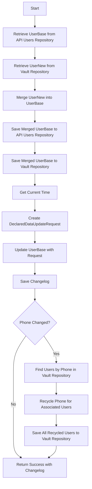

# User declared data flow

## Update use case

```mermaid
graph TD
    A[Start] --> B[Retrieve UserBase from API Users Repository]
    B --> C[Retrieve UserNew from Vault Repository]
    C --> D[Merge UserNew into UserBase]
    D --> E[Save Merged UserBase to API Users Repository]
    E --> F[Save Merged UserBase to Vault Repository]
    F --> G[Get Current Time]
    G --> H[Create DeclaredDataUpdateRequest]
    H --> I[Update UserBase with Request]
    I --> J[Save Changelog]
    J --> K{Phone Changed?}
    K -- No --> L[Return Success with Changelog]
    K -- Yes --> M[Find Users by Phone in Vault Repository]
    M --> N[Recycle Phone for Associated Users]
    N --> O[Save All Recycled Users to Vault Repository]
    O --> L[Return Success with Changelog]
```

## Class diagram

```mermaid
classDiagram
    Field .. Log
    Log .. Changelog
    Changelog .. Integrator
    UserDeclaredData .. Changelog
    UserDeclaredData .. DeclaredDataUpdateRequest
    DeclaredDataUpdateRequest .. Integrator
    UserDeclaredData .. Nickname
    DeclaredDataUpdateRequest .. Nickname
    UserDeclaredData .. Phone
    DeclaredDataUpdateRequest .. Phone
    UpdateDeclaredDataUseCase .. UserDeclaredDataRepository
    UpdateDeclaredDataUseCase .. ChangelogRepository
    UpdateDeclaredDataUseCase .. Clock
    UpdateDeclaredDataUseCaseOutput .. Changelog
    namespace domain {
        class Integrator {
            -value string

            +Equals(other Integrator) bool
            +String() string 
            +Value() string
        }
    }
    namespace changelog {
        class Changelog{
            -id         int64
            -userID     int64
            -executedBy domain.Integrator
            -occurredOn time.Time
            -logs       []Log

            +AddLog(log Log)
            +ExecutedBy() domain.Integrator
            +ID() int64
            +Logs() []Log
            +OccurredOn() time.Time
            +String() string
            +UserID() int64
        }

        class Log {
            -field    Field
            -oldValue *string
            -newValue *string

            +Field() Field
            +NewValue() *string
            +OldValue() *string
            +String() string
        }

        class Field {
            -value string

            +Equals(other Field) bool
            +String() string
            +Value() string
        }

        class ChangelogRepository {
            <<interface>>
            +Save(changelog Changelog) error
        }
    }
    namespace declareddata {
        class UserDeclaredData {
            -id            int64
            -nickname      *Nickname
            -phone         *Phone
            -recycledPhone bool
            -phoneChanged  bool

            +ID() int64
            +Merge(other UserDeclaredData)
            +Nickname() *Nickname
            +Phone() *Phone
            +PhoneChanged() bool
            +RecyclePhone()
            +RecycledPhone() bool
            +String() string
            +Update(request DeclaredDataUpdateRequest, requestedOn time.Time) (changelog.Changelog, error)
        }
        class UserDeclaredDataRepository {
            <<interface>>
            +FindByID(id int64) (UserDeclaredData, error)
            +FindByPhone(phone Phone) ([]UserDeclaredData, error)
            +Save(user UserDeclaredData) error
            +SaveAll(users []UserDeclaredData) error
        }
        class DeclaredDataUpdateRequest {
            -nickname    *Nickname
            -phone       *Phone
            -requestedBy  domain.Integrator
            -requestedOn time.Time

            +Nickname() *Nickname
            +Phone() *Phone
            +RequestedBy() domain.Integrator
            +RequestedOn() time.Time
            +String() string
        }
        class Nickname {
            -value string

            +Equals(other Nickname) bool
            +String() string
            +Value() string
        }
        class Phone {
            -countryCode string
	        -phoneNumber string

            +CountryCode() string
            +Equals(other Phone) bool
            +FormattedFullNumber() string
            +PhoneNumber() string
            +String() string
        }
    }
    namespace shared {
        class Clock {
            <<interface>>
            Now() time.Time
        }
    }
    namespace usecases {
        class UpdateDeclaredDataUseCase {
            -vaultUserDeclaredDataRepository    declareddata.UserDeclaredDataRepository
            -apiUsersUserDeclaredDataRepository declareddata.UserDeclaredDataRepository
            -changelogRepository                changelog.ChangelogRepository
            -clock                              shared.Clock

            +Execute(input UpdateDeclaredDataUseCaseInput) (UpdateDeclaredDataUseCaseOutput, error)
        }

        class UpdateDeclaredDataUseCaseInput {
            +UserID      int64
            +Nickname    *string
            +CountryCode *string
            +PhoneNumber *string
            +RequestedBy string
        }

        class UpdateDeclaredDataUseCaseOutput {
            +Changelog changelog.Changelog
        }
    }
```

