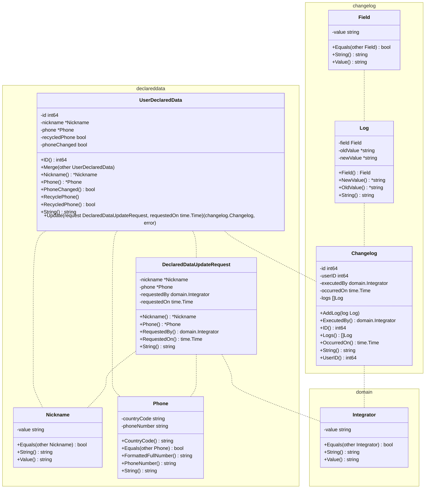

# User declared data flow

## Class diagram

```mermaid
classDiagram
    Field .. Log
    Log .. Changelog
    Changelog .. Integrator
    UserDeclaredData .. Changelog
    UserDeclaredData .. DeclaredDataUpdateRequest
    DeclaredDataUpdateRequest .. Integrator
    UserDeclaredData .. Nickname
    DeclaredDataUpdateRequest .. Nickname
    UserDeclaredData .. Phone
    DeclaredDataUpdateRequest .. Phone
    namespace domain {
        class Integrator {
            -value string

            +Equals(other Integrator) bool
            +String() string 
            +Value() string
        }
    }
    namespace changelog {
        class Changelog{
            -id         int64
            -userID     int64
            -executedBy domain.Integrator
            -occurredOn time.Time
            -logs       []Log

            +AddLog(log Log)
            +ExecutedBy() domain.Integrator
            +ID() int64
            +Logs() []Log
            +OccurredOn() time.Time
            +String() string
            +UserID() int64
        }

        class Log {
            -field    Field
            -oldValue *string
            -newValue *string

            +Field() Field
            +NewValue() *string
            +OldValue() *string
            +String() string
        }

        class Field {
            -value string

            +Equals(other Field) bool
            +String() string
            +Value() string
        }
    }
    namespace declareddata {
        class UserDeclaredData {
            -id            int64
            -nickname      *Nickname
            -phone         *Phone
            -recycledPhone bool
            -phoneChanged  bool

            +ID() int64
            +Merge(other UserDeclaredData)
            +Nickname() *Nickname
            +Phone() *Phone
            +PhoneChanged() bool
            +RecyclePhone()
            +RecycledPhone() bool
            +String() string
            +Update(request DeclaredDataUpdateRequest, requestedOn time.Time) (changelog.Changelog, error)
        }
        class DeclaredDataUpdateRequest {
            -nickname    *Nickname
            -phone       *Phone
            -requestedBy  domain.Integrator
            -requestedOn time.Time

            +Nickname() *Nickname
            +Phone() *Phone
            +RequestedBy() domain.Integrator
            +RequestedOn() time.Time
            +String() string
        }
        class Nickname {
            -value string

            +Equals(other Nickname) bool
            +String() string
            +Value() string
        }
        class Phone {
            -countryCode string
	        -phoneNumber string

            +CountryCode() string
            +Equals(other Phone) bool
            +FormattedFullNumber() string
            +PhoneNumber() string
            +String() string
        }
    }
```